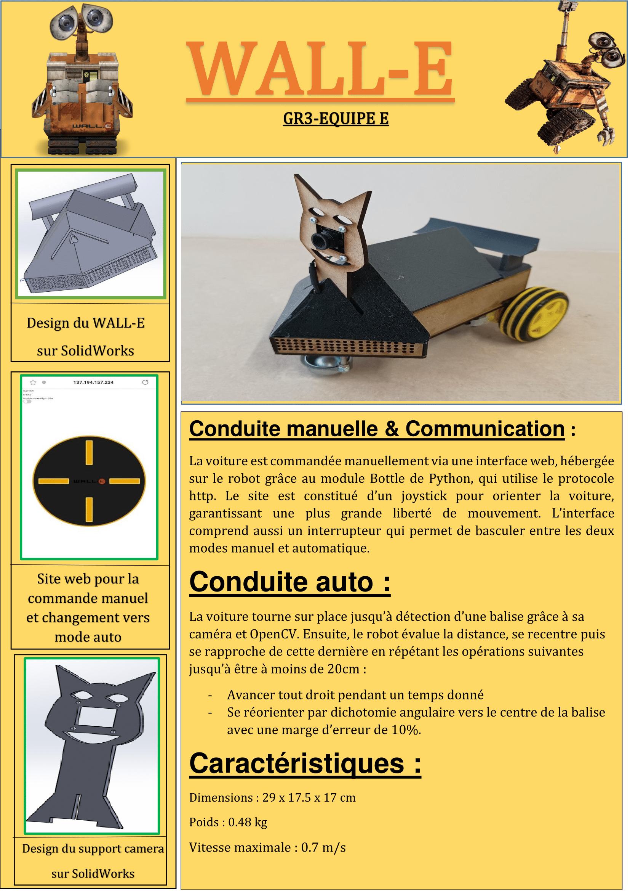

# Projet Artefact

### Description du projet

L'idée générale du projet est de faire une voiture téléguidée via une interface web, puis intelligente.

Pour plus de renseignements : [Forum de description du projet](https://discourse.r2.enst.fr/)

### Fiche de présentation du robot

### Explication de notre travail

Pour comprendre notre travail, rendez-vous sur la page [Wiki](https://gitlab.telecom-paris.fr/proj103/2324/gr3/teame/-/wikis/pages) de notre dépôt git, ou suivez l'arborescence des fichiers du dépôt, où sont présents des éléments de documentation.

### Chronologie  du projet

***20/09/2023 :***
-	Connexion en headless depuis le terminal (grâce au rooter)
-	Installation de l’OS pour la raspberry
-	Réflexions sur le design de la voiture 

***27/09/2023 :***
-	Connexion de la carte Raspberry au réseau Campus-Telecom
-	Dépôt git de chaque personne + création d'une clé ssh pour la carte raspberry
-   Connexion de la carte Raspberry au réseau Campus-Telecom
-	Configuration de la date pour la carte Raspberry
-	Documentation pour la caméra 
-	Création du design de la voiture sur SolidWorks

***04/10/2023 :***
-	Optimisation du design et ajout de nouvelles pièces (vis, écrous)
-	Soudure des câbles au moteur
-	Connexion de la caméra sur le Raspberry. 
-	Impression du châssis avec la découpeuse laser. 

***11/10/2023 :*** 
- Installation des paquets pour le moteur et langages de programmation (C, Python)
- Installation de OpenCV et reconnaissance en temps réel de QR Code (avec l'identifiant associé)
- Configuration d'un fichier ".service" qui nous permet de lancer des programmes au démarrage de la Raspberry
- Impression de pièces pour le design de la voiture en 3D 
- Table ronde sur le moyen de contrôler la voiture manuellement : on utilisera une interface web avec un joystick omnidirectionnel

***18/10/2023 :*** 
- Contrôle des moteurs et programmes python pour contrôler la vitesse des moteurs avec la position du joystick
- Installation de Open CV sur la Raspberry
- Développement du site web

***25/10/2023 :***
- Montage de la voiture
- Régression (en 1/x) pour évaluer les distances avec la caméra 
- Détection vidéo des arucos et pilotage automatique en fonction des arucos
- Connexion de la carte Raspberry au site web 
- Contrôle et mise en route de la voiture : session de pilotage depuis l'interface web. 

***14/11/2023 :***
- Modification du sens du Motor Driver (et pour cela soudure de fils) pour éviter de la brûler
- Essais plus poussés de la conduite manuelle de la voiture, vérification que le programme ne s'arrête plus de manière intempestive
- Premiers essais de la conduite automatique

***21/11/2023 :***
- Essais plus poussés de la conduite automatique de la voiture. Nos programmes ne sont pas résilients : la vision n'est pas assez stable.

On recommence le développement en avançant par étape :

-> Création de plusieurs versions du module "capter.py" qui doivent permettre de décider où les capacités de vision limitent la conduite automatique. On avance par palier : 
*1capter.py est plus résilient que 2capter.py, lui-même plus résilient que 3capter.py ...*

-> Le dernier programme capable de capter efficacement un ArUco sera choisi (soit le programme qui minimise le temps d'attente ou de calibrage tout en étant capable de capter et de centrer un ArUco dans son champs de vision avec une forte probabilité).

- Test des fonctions de calcul de l'angle de déviation de la caméra par rapport à un ArUco.

- Nouveau design de support pour caméra afin d'avoir cette dernière à la même altitude que les marqueurs.

***22/11/2023 :***
Travail sur le plan établi le 21/11 :

1) Tester 1capter.py : fonctionne bien
-> on a une fonction résiliente qui cherche un ArUco et s'arrête une fois trouvé

2) Tester 2capter.py : ne fonctionne pas
-> on garde 1capter.py comme architecture de base pour le recherche de marqueurs
Conclusion : on n'arrive pas à capter à coup sûr l'ArUco sans implémenter des périodes où la caméra est fixe.

3) Tester 3recentrer.py : fonctionne bien
-> même principe que 1capter.py en ajoutant à la condition "un aruco est présent dans le cadre" : "le marqueur doit être au centre de l'écran pour l'arrêt du programme"
Conclusion : on a une fonction résiliente qui cherche un ArUco, le cadre dans son champ de vision et s'arrête une fois cette opération effectuée.

4) Combiner 3recentrer avec du mouvement vers l'avant , création d'une boucle :

->Tant que vrai :

    ->si un marqueur est dans le cadre
        ->si le marqueur est centré dans le champ de vision
            ->avance à vitesse vitesse_avance pendant temps_avance secondes
            ->retour début de boucle
        ->sinon
            ->tente de cadrer le marqueur en effectuant une rotation (dans le bon sens) à vitesse vitesse_rotation pendant temps_rotation/3
            ->retour début de boucle

    ->sinon
        ->tente de trouver un marqueur en effectuant une rotation (vers la droite) à vitesse vitesse_rotation pendant temps_rotation
        ->retour début de boucle

5) Recherche du 4-uplet ( vitesse_avance , temps_avance , vitesse_rotation , temps_rotation) qui minimise le temps de parocurs
Conclusion :
-> vitesse_avance et temps_avance ne doivent pas être trop grands sous peine de rentrer dans le marqueur ou de le perdre de vue à chaque fois que la voiture avance.
-> vitesse_rotation et temps_rotation doivent être assez grands pour qu'un tour complet ne prenne pas trop longtemps mais assez petits pour que le recadrage puisse se faire

6) Essais sur les parcours dans l'entrée de l'école
-> Les marqueurs sont moins bien détectés que lors des entraînements précédents
    -> Conclusion rapide que cela est dû à la faible taille du contour blanc autour des balises utilisées par les circuits officiels
    -> Adaptation du code à cette caractéristique

***23/11/2023 :***
Evaluation intermédiaire.
-> Le parcours est réussi dans les temps. La partie manuelle est un succès. Lors de la partie automatique, le véhicule a perdu les 
marqueurs de son champs de vision à deux ou trois reprises mais a tout de même effectué le travail demandé.

Fin résumé des séances à partir de l'évaluation intermédiaire. 